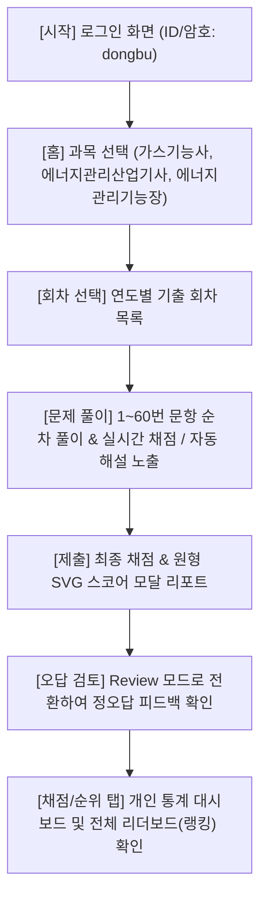

# 🎓 CBT Web App (최강 CBT 스타일 문제풀이 서비스)

> **프로젝트 URL**: [https://cbt0.github.io](https://cbt0.github.io)  
> **현재 버전**: `CBT V2.0`  
> **최근 변경**: 2026-06-19 — Supabase(Auth + Postgres) 통합 및 클라우드 동기화 기능 추가. 로컬 데이터의 서버 마이그레이션 및 제출 시 서버 동기화가 도입되었습니다.
> **주요 대상 과목**: 에너지관리기능장, 에너지관리산업기사, 가스기능사, 에너지기능사, 공조냉동기계기능사

이 웹 애플리케이션은 국가기술자격증(에너지, 가스, 공조 분야) 필기 기출문제를 효율적으로 학습하고 실전처럼 모의고사를 치를 수 있도록 돕는 **반응형 모바일 우선(Mobile-First) SPA(Single Page Application) 웹 서비스**입니다.

---

## 📌 1. 프로젝트 개요 (Overview)

### 💡 기획 배경 및 목적
* **자격증 합격 최적화**: 자격증 시험 준비의 핵심인 '기출문제 무한 반복'을 스마트폰과 PC 어디서나 쾌적하게 수행할 수 있도록 설계했습니다.
* **실시간 피드백**: 문제를 풀자마자 정오답 여부와 해설(힌트)을 즉시 제공하여 오답 노트를 따로 만들지 않아도 학습 효과를 극대화합니다.
* **모바일 및 UI 가독성 극대화**: 글자가 작아지고 여백이 낭비되던 기존 모바일 CBT의 단점을 보완하여, 스마트폰의 좁은 화면에서도 지문과 표(Table)를 큼직하게 읽을 수 있는 최적의 뷰포트 레이아웃을 구현했습니다.

### 🌟 핵심 기능
1. **Premium Dark 테마 및 반응형 UX**: 눈의 피로를 최소화하는 글라스모피즘 스타일의 다크 모드를 지원하며, 768px 이하 모바일 환경에서는 하단 네비게이션 탭바 기반으로 뷰가 전환됩니다.
2. **실시간 채점 및 자동 힌트**: 보기 체크 시 즉각적인 시각 피드백(초록/빨강 테두리 및 배경)이 발생하고 해설 패널이 자동으로 확장됩니다.
3. **OMR 답안 마킹 현황판**: 1번부터 60번까지의 마킹 상태를 실시간으로 보여주며, 마킹판의 번호를 누르면 해당 문제 페이지로 즉시 이동합니다.
4. **SVG 스코어 애니메이션**: 시험 제출 시 60점 이상 합격(PASS)/불합격(FAIL) 판정을 SVG stroke 애니메이션 원형 게이지로 역동적으로 보여줍니다.
5. **개인 학습 통계 및 전체 순위(리더보드)**: 브라우저 로컬 저장소를 활용해 사용자별 학습 로그(푼 문제수, 평균 정답률, 합격 회차)를 분석하여 채점 탭 내부에서 실시간 랭킹 순위표를 렌더링합니다.

---

## ⚙️ 2. 시스템 상세도 및 아키텍처 (Architecture Details)

### 🏗️ 시스템 흐름도 (System Flowchart)



### 📁 디렉토리 및 파일 구조 (Directory Structure)

```text
cbt0.github.io/
├── index.html              # 메인 SPA 뼈대 및 모바일 네비게이션 마크업
├── plan.md                 # 프로젝트 계획서 및 마일스톤 로그
├── README.md               # [현재 파일] 프로젝트 개요 및 상세도 설명서
├── css/
│   └── style.css           # UI 테마, 애니메이션, 모바일 탭 라우팅 CSS
├── js/
│   └── app.js              # 퀴즈 엔진 상태 제어, 비동기 로드, 로컬 스토리지 데이터 로직
└── data/
    ├── gas/
    │   └── gas_questions.json          # 가스기능사 기출 데이터 (18회차 / 1,080문제)
    ├── energy_ginungjang/
    │   └── energy_ginungjang_questions.json # 에너지관리기능장 기출 데이터 (20회차 / 1,200문제)
    ├── energy_sanupgisa/
    │   └── energy_sanupgisa_questions.json  # 에너지관리산업기사 기출 데이터 (22회차 / 1,760문제)
    └── source/
        └── *.docx              # 파싱 대상 원본 한글/워드 기출 복원 문서
```

### 🧠 전역 상태 관리 모델 (Global State Management)
`js/app.js`에서 단일 전역 `state` 객체를 기반으로 모든 SPA 상태 변화를 단방향 추적합니다.

```javascript
const state = {
    exams: {},              // 비동기로 로드된 과목별 기출 데이터 캐시
    activeSubject: 'home',  // 현재 활성화된 과목명 ('gas', 'energy_industrial' 등)
    activeRound: null,      // 선택된 회차 정보 (연도, 회차, 문제 배열)
    activeQuestionIndex: 0, // 문제 풀이 중인 현재 인덱스 (0~59)
    userAnswers: {},        // 사용자가 선택한 정답 마킹 {questionIdx: choiceNum}
    quizMode: 'solving',    // 퀴즈 진행 모드 ('solving': 풀이 중, 'review': 제출 후 검토)
    timerInterval: null,    // 초 시계 갱신 타이머 인터벌
    timeSpentSeconds: 0,    // 누적 풀이 소요 시간 (초 단위)
    currentQuestions: []    // 현재 회차의 60개 문제 객체 세트
};
```

### 💾 데이터베이스 스키마 설계 (JSON Database Schema)
각 과목의 기출 데이터는 JSON 어레이 구조로 패키징되어 초기 1회 fetch 후 브라우저 메모리에 캐싱됩니다.

```json
[
  {
    "year": 2024,
    "round": 1,
    "questions": [
      {
        "question_num": 1,
        "question": "지문 내용 (HTML 표 포맷 <table> 포함 가능)",
        "options": [
          "보기 1번 내용",
          "보기 2번 내용",
          "보기 3번 내용",
          "보기 4번 내용"
        ],
        "answer": 2,
        "hint": "풀이 해설 및 자동 힌트 설명 내용"
      }
    ]
  }
]
```

---

## 🛠️ 3. 핵심 아키텍처 의사결정 (Technical Decisions)

1. **단일 JSON 통합 DB 로딩 (Single JSON Loading)**
   * **결정**: 회차별로 수십 개의 JSON 파일을 쪼개서 요청하는 대신 과목별 통합 JSON 파일(`gas_questions.json`, `energy_ginungjang_questions.json` 등)을 첫 진입 시 한 번만 로드하여 캐시합니다.
   * **이유**: 첫 화면 진입 시 약 1MB 가량의 데이터가 한 번에 캐싱되어, 이후 사용자가 회차를 자유롭게 넘나들거나 문제를 풀 때 네트워크 대기 지연이 전혀 발생하지 않는 극상의 전환 반응성을 보장합니다.
2. **모바일 반응형 멀티 모드 탭바 (Dynamic Navigation)**
   * **결정**: PC 환경에서는 좌측 문제지 영역, 우측 OMR 답안 마킹판을 넓게 배치하되, 992px 이하 모바일 화면에서는 하단 헤더 탭바(**홈 / 문제 / 채점 / 설정**)를 터치하여 독립적으로 화면을 전환하도록 이원화했습니다.
   * **이유**: 스마트폰 핑거 터치 영역을 최대한 확보하고, OMR 마킹판의 특정 번호를 누르면 즉시 문제 탭으로 전환 포커싱되도록 유기적인 JS 이벤트를 매핑하여 좁은 화면에서도 원활한 흐름을 유지합니다.
3. **로컬 스토리지 기반 개인 데이터 분석**
   * **결정**: 외부 백엔드 DB 서버에 의존하지 않고 브라우저 고유의 `localStorage`를 활용하여, ID별 진척 상태(`cbt_progress_...`)와 통계 정보를 실시간으로 계산 및 기록합니다.
   * **이유**: 서버 비용 및 네트워크 통신 장애 리스크가 없으며, 정적 사이트 호스팅(GitHub Pages)만으로도 개별 사용자 맞춤형 학습 관리 및 동적 랭킹 순위표 리더보드를 가볍고 완벽하게 작동시킬 수 있습니다.

---

## 🚀 4. 시작하기 및 개발 환경 안내 (Getting Started)

### 💻 로컬 테스트 방법 (Local Run)
본 웹앱은 비동기 fetch를 통해 JSON 데이터를 동적으로 가져오므로, `index.html` 파일을 단순히 더블클릭(`file://`)하여 열 경우 브라우저 보안 정책(CORS)으로 인해 기출문제가 연동되지 않습니다.
반드시 아래와 같이 로컬 웹서버를 기동하여 접속해야 정상 동작합니다.

```bash
# 1. 저장소 복제 및 해당 폴더 이동
git clone https://github.com/cbt0/cbt0.github.io.git
cd cbt0.github.io

# 2. 파이썬 기본 웹서버 실행 (포트 8000)
python3 -m http.server 8000
```
이후 웹 브라우저에서 `http://localhost:8000`에 접속하여 테스트 및 검증을 수행할 수 있습니다.
