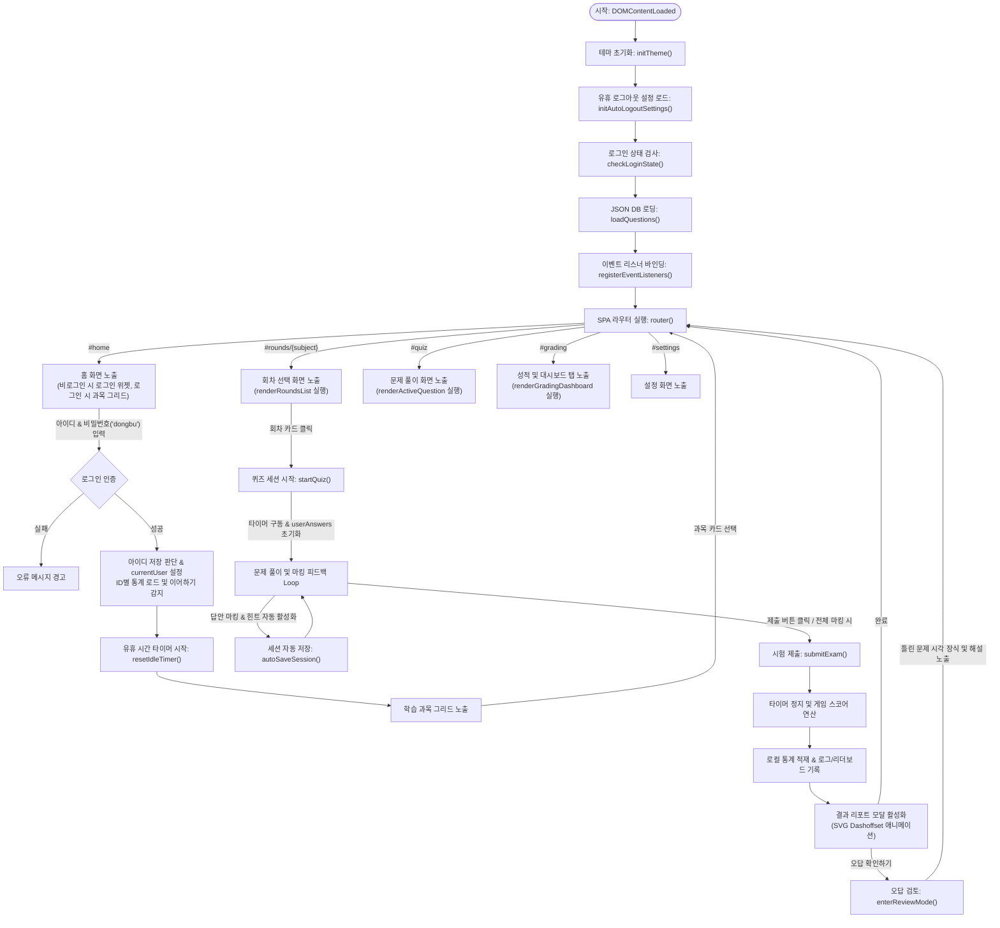
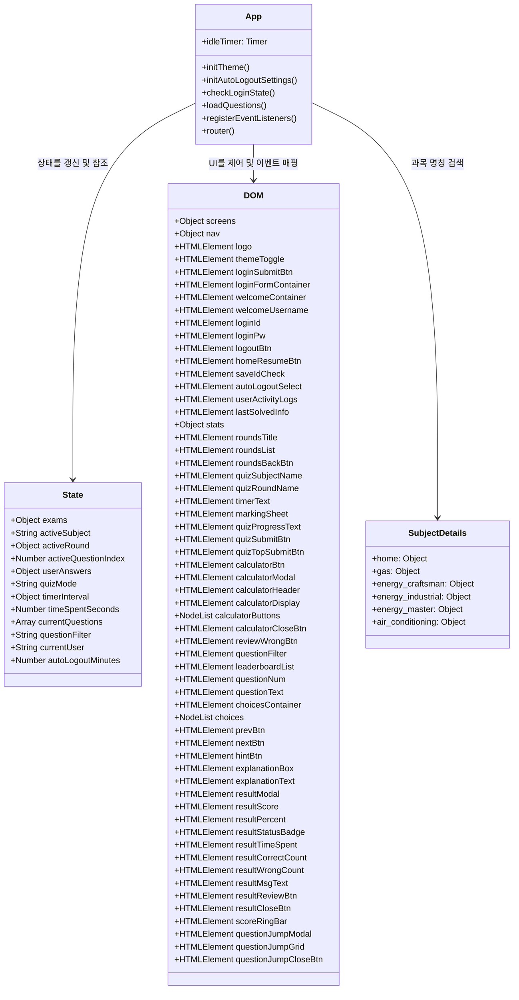
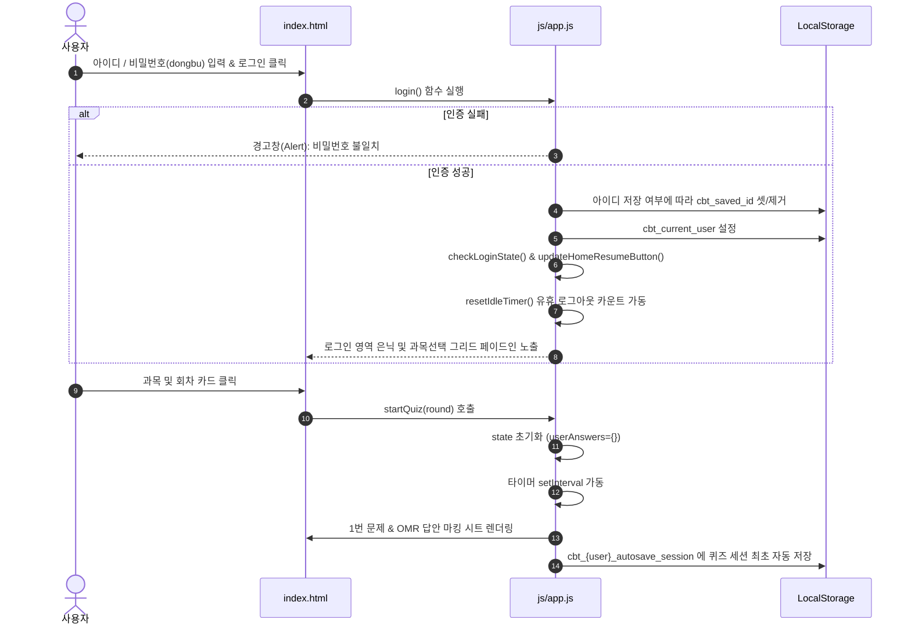
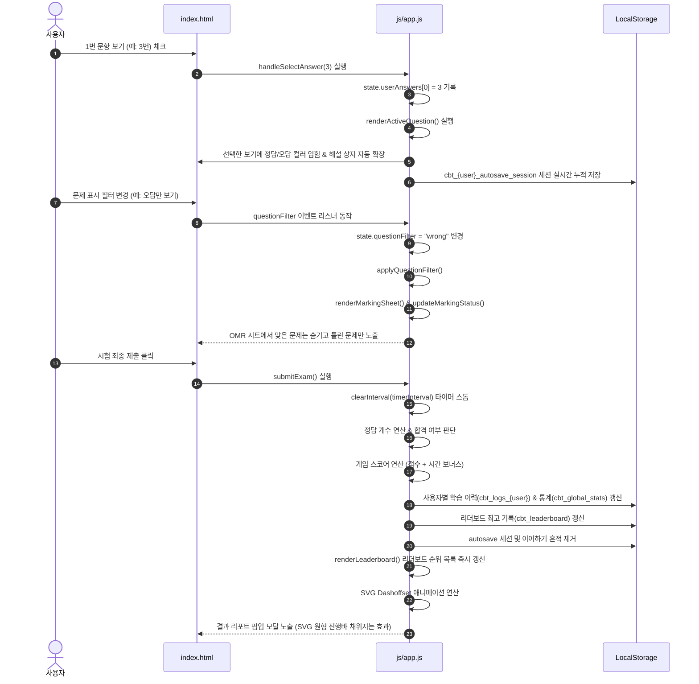
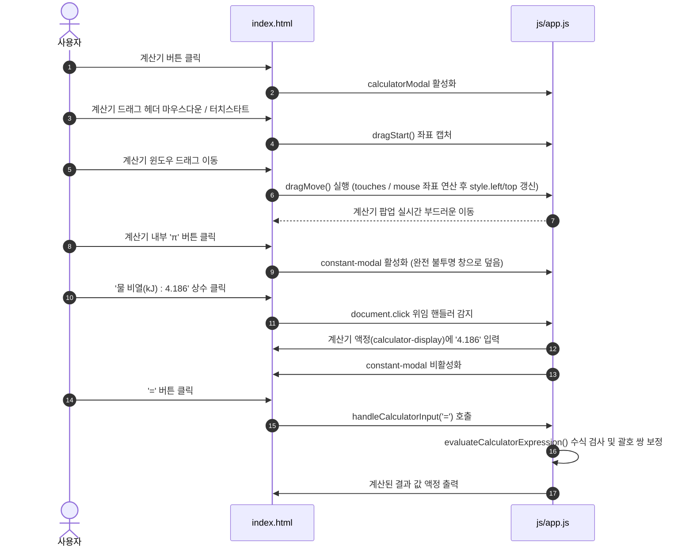

# 🎓 CBT 웹 애플리케이션 상세 코드 분석 및 기술 명세서 (code_review.md)

본 문서는 최강 CBT 스타일 문제풀이 웹 애플리케이션의 핵심 소스 코드인 `index.html`, `js/app.js`, `css/style.css`를 정밀하게 분석하여 프로그램의 구조, 흐름, 상태 전이 및 함수별 세부 명세를 기록한 개발자 기술 검토서입니다.

---

## 📌 1. 전체 프로그램 아키텍처 및 실행 흐름도

애플리케이션은 **Vanilla JS와 SPA(Single Page Application) 패턴**을 취하고 있으며, 사용자의 브라우저 URL 해시(hash) 변화를 라우터가 감지하여 화면을 그리는 구조입니다.

### 🏗️ 전체 앱 실행 흐름도 (Application Lifecycle Flowchart)


---

## 📌 2. 구조 다이어그램 (Class & State Chart)

자바스크립트의 전역 상태 객체(`state`), DOM 엘리먼트 캐시(`dom`), 기출 매핑 정보 및 유휴 리스너들의 정적 연결 구조입니다.



---

## 📌 3. 흐름 시나리오 (Sequence Chart)

### 시나리오 A: 로그인 처리, 세션 세이브 및 퀴즈 시작 흐름


### 시나리오 B: 문항 선택, 피드백, 필터링 및 최종 제출 흐름


### 시나리오 C: 드래그 앤 드롭 계산기 및 상수/점프 제어 흐름


---

## 📌 4. 전역 변수 및 DOM 매핑 명세 (Static Variables & DOM Map)

### ① 설정 변수 명세
- **`subjectDetails` (Object)**: 과목 키값(`gas`, `energy_master` 등)과 화면에 렌더링될 과목명 및 실제 기출 데이터 여부(`isReal`)를 한데 모은 상수 맵입니다.
- **`mockExams` (Object)**: 기출 복원이 준비 중인 과목(에너지기능사, 공조기능사 등)에 대한 샘플 문제(3~4문항)를 담은 하드코딩된 데이터베이스 구조입니다.

### ② DOM 요소 바인딩 명세 (`dom` 객체)
스크립트 가동 속도 최적화 및 잦은 `document.getElementById` 호출 방지를 위해 아래와 같이 UI 요소들을 그룹화하여 최초 1회 로딩 시 캐싱합니다.

| 분류 | 변수명 (DOM ID / Selector) | 역할 |
| :--- | :--- | :--- |
| **화면** | `dom.screens.home`, `.rounds`, `.quiz`, `.grading`, `.settings` | SPA 각 페이지용 `<section>` 컨테이너 매핑 |
| **네비게이션** | `dom.nav.home`, `.quiz`, `.grading`, `.settings` | 상단 고정 헤더 메뉴 탭 버튼 매핑 |
| **로고/테마** | `dom.logo` (#logo-btn), `dom.themeToggle` (#theme-toggle) | 홈 이동 및 다크/라이트 테마 변경 버튼 |
| **로그인** | `dom.loginFormContainer`, `dom.welcomeContainer`, `dom.loginId`, `dom.loginPw` | 사용자 인증 폼 요소 및 로그인 세션 제어용 뷰 |
| **이어하기** | `dom.homeResumeBtn` (#home-resume-btn) | 홈 화면에 표시되는 복원 큐 |
| **대시보드** | `dom.userActivityLogs`, `dom.lastSolvedInfo`, `dom.stats.*` | 누적 활동 이력, 이어 풀기 카드, 누적 점수 통계 |
| **회차 선택** | `dom.roundsTitle`, `dom.roundsList`, `dom.roundsBackBtn` | 과목별 기출 회차 렌더링 공간 및 뒤로가기 제어 |
| **퀴즈 화면** | `dom.quizSubjectName`, `dom.quizRoundName`, `dom.timerText` | 메타 정보(과목명, 회차명) 바인딩 및 초시계 |
| **답안 시트** | `dom.markingSheet`, `dom.quizProgressText` | OMR 마킹 버튼 그리드 및 문항 진도율 정보 |
| **문제 카드** | `dom.questionNum`, `dom.questionText`, `dom.choices` | 문제 번호 뱃지, 문제 내용, 1~4번 보기 엘리먼트 |
| **액션 컨트롤** | `dom.prevBtn`, `dom.nextBtn`, `dom.hintBtn`, `dom.explanationBox` | 이전/다음 문제 전환, 해설 영역 온/오프 토글 제어 |
| **성적 모달** | `dom.resultModal`, `dom.resultScore`, `dom.scoreRingBar` | 제출 결과 팝업, SVG stroke-dashoffset 링 |
| **계산기** | `dom.calculatorModal`, `dom.calculatorDisplay`, `dom.calculatorHeader` | 공학 계산기 팝업, 드래그 손잡이 및 수식 입력 액정 |
| **점프 모달** | `dom.questionJumpModal`, `dom.questionJumpGrid` | 특정 문항으로 즉시 점프할 수 있는 번호판 팝업 |

---

## 📌 5. 함수(Functions) 명세 및 상세 분석표

`js/app.js`에 정의된 핵심 동작 로직의 명세서입니다.

| 함수명 | 입력 매개변수 | 반환값 (Type) | 상세 동작 및 부작용 (Side Effects) |
| :--- | :--- | :--- | :--- |
| `initTheme` | 없음 | 없음 | 로컬스토리지의 `cbt_theme`를 읽어 다크/라이트 테마를 바인딩합니다. |
| `toggleTheme` | 없음 | 없음 | `data-theme` 속성을 스왑하고 로컬스토리지 상태를 토글 갱신합니다. |
| `checkLoginState` | 없음 | 없음 | `cbt_current_user` 유무를 확인해 로그인 폼과 과목선택 섹션을 활성/은닉합니다. |
| `login` | 없음 | 없음 | ID 유효성 및 PW('dongbu') 인증 후 세션을 시작하고, 아이디 저장을 수행합니다. |
| `logout` | 없음 | 없음 | 인증 키를 로컬스토리지에서 지우고 퀴즈 타이머를 소멸시킨 후 홈 화면으로 튕겨냅니다. |
| `resetIdleTimer` | 없음 | 없음 | 유휴 시간 감지 `setTimeout`을 재가동합니다. 30분 초과 시 자동 로그아웃을 유도합니다. |
| `logUserActivity` | `msg` (String) | 없음 | 사용자 행위를 타임스탬프와 함께 로컬로그(`cbt_{user}_logs`) 배열 맨 앞에 주입합니다. |
| `loadQuestions` | 없음 | `Promise<void>` | `data/` 경로의 기출문제 JSON 데이터를 비동기 fetch하여 `state.exams`에 캐싱합니다. |
| `router` | 없음 | 없음 | URL 해시 상태를 해석하여 해당 SPA 뷰 섹션과 상단 네비게이션 활성 클래스를 토글합니다. |
| `renderRoundsList`| `subject` (String) | 없음 | 과목 JSON 데이터를 읽어 시리즈(`round.subject`) 단위로 그룹화한 후 1줄 단추들을 그립니다. |
| `startQuiz` | `round` (Object), `isResume` (Bool) | 없음 | 퀴즈 세션을 초기화하고, 타이머 인터벌을 가동시키며 1번 문제를 렌더링합니다. |
| `renderActiveQuestion`| 없음 | 없음 | 현재 인덱스의 문제를 문제 카드에 그리며, 풀이 여부에 따라 해설 상자를 열거나 닫습니다. |
| `handleSelectAnswer`| `choiceNum` (Number) | 없음 | 보기를 체크하면 정오답 피드백 색상을 주입하고, 해설을 열고, 진척을 자동 세이브합니다. |
| `doesQuestionMatchFilter`| `index` (Number) | `Boolean` | 특정 문항이 현재 필터(전체, 오답, 미제출)에 부합하는 상태인지 검증합니다. |
| `getAdjacentFilteredIndex`| `direction` (Number) | `Number/Null` | 필터 조건에 부합하는 이전(-1) 또는 다음(+1) 유효 문제 번호 인덱스를 탐색해 반환합니다. |
| `submitExam` | 없음 | 없음 | 문제를 채점하여 100점 점수 및 게임 스코어를 구하고, 통계 적재 후 모달창을 오픈합니다. |
| `reviewWrongAnswers`| 없음 | 없음 | 로컬스토리지의 이력을 역추적해 틀렸던 문항들만으로 이뤄진 가상 오답 회차를 기동합니다. |
| `renderLeaderboard` | 없음 | 없음 | 최고 게임 점수 순위표 데이터를 내림차순 정렬하여 순위 탭에 메달 배지와 함께 렌더링합니다. |
| `handleCalculatorInput`| `value` (String) | 없음 | 액정에 수식을 기입하며, 백스페이스, 초기화(C), 수식 연산(=) 처리를 분기 작동합니다. |
| `evaluateCalculatorExpression`| `expr` (String) | `Number` | 수식의 열려 있는 괄호를 완성하고 안전하게 계산해 줍니다. |
| `openQuestionJumpModal`| 없음 | 없음 | 문제 번호 뱃지 클릭 시 60문항의 동적 점프 그리드판 모달을 렌더링하고 출력합니다. |

---

## 📌 6. 핵심 소스 코드 파일별 기술 분석

### 1. HTML 마크업 아키텍처 ([index.html](file:///D:/git/cbt0.github.io/index.html))
- **SPA 뷰 스위칭 프레임**: 
  여러 HTML 페이지로 분기하는 대신 단일 도큐먼트 내에 다수의 `<section class="view-section">`을 배치하여 브라우저의 리스크를 없애고 렌더링 전환 효과를 유도합니다.
- **모달 오버레이 구조**: 
  결과 리포트, 계산기, 상수 선택, 문제 점프 팝업을 모두 최상위 레벨의 공통 모달 오버레이 구조(`.modal-overlay`)로 선언하여 `z-index` 충돌을 미연에 방지하고 일관된 오프너 제어(클래스 `.active` 토글)가 가능하도록 통일했습니다.

### 2. 프리미엄 다크/라이트 CSS 디자인 시스템 ([css/style.css](file:///D:/git/cbt0.github.io/css/style.css))
- **테마 변수 시스템**:
  `:root` 및 `[data-theme="light"]` 내에 배경색, 전경색, 유리 질감 테두리, 그림자, 주요 브랜드 컬러 변수를 선언하여 스크립트에서 단 한 줄의 제어로 테마 전체가 부드럽게 스왑되도록 빌드했습니다.
- **포인터 이벤트 충돌 차단**:
  계산기가 화면 우측에 항시 띄워진 채로 뒤쪽의 문항을 원활하게 클릭할 수 있도록 하기 위해, 오버레이 컨테이너에는 `pointer-events: none`을 주어 뚫리게 하고, 계산기 본체 카드에만 `pointer-events: auto`를 명시적으로 주어 터치 간섭 버그를 완벽하게 차단했습니다.
- **Nested Table 스타일**:
  지문 및 해설에 들어가는 중첩 표(`.nested-table`)의 테두리를 은은한 반투명 색상으로 장식하고 `white-space: normal` 속성을 주어 모바일 뷰포트 너비에 맞게 표 셀 내부 텍스트가 자동 개행되도록 설계했습니다.

### 3. 고성능 Vanilla JS 퀴즈 엔진 및 유틸리티 ([js/app.js](file:///D:/git/cbt0.github.io/js/app.js))
- **중복 배제 정렬 랭킹 알고리즘**:
  ```javascript
  const bestByUser = new Map();
  stored.forEach(entry => {
      const key = `${entry.userId}-${entry.summary}`;
      const existing = bestByUser.get(key);
      if (!existing || entry.gameScore > existing.gameScore) {
          bestByUser.set(key, entry);
      }
  });
  const bestRecords = Array.from(bestByUser.values());
  bestRecords.sort((a, b) => b.gameScore - a.gameScore);
  ```
  단순 랭킹이 아닌 동일 과목/회차의 최고 득점만을 추려 리더보드에 출력하는 구조를 JS 맵(`Map`) 객체와 키 매핑 조합으로 시간 복잡도 $O(N)$ 내에 고속 집계합니다.
- **괄호 자동 보정식 계산기 파서**:
  ```javascript
  const openParens = (current.match(/\(/g) || []).length;
  const closeParens = (current.match(/\)/g) || []).length;
  if (openParens > closeParens) {
      current += ')'.repeat(openParens - closeParens);
  }
  ```
  자연로그 `ln(` 나 루트 `sqrt(` 처럼 열린 괄호만 남은 채 사용자가 `=`를 누를 경우, 정규식 매칭을 통해 부족한 개수만큼 닫는 괄호를 수식 후미에 동적으로 이어 붙여 구문 오류(Syntax Error)를 방지하는 방어형 계산기 알고리즘을 담고 있습니다.
